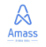

#  **펫팜(PETPHARM)**
## **자격요건**
> - 2년 이상 React 를 활용한 반응형 웹 서비스 개발 경험
> - React Hook, React Query, Redux / Recoil 활용
> - SPA, CSR, SSR, SEO 에 대한 이해
> - RESTful API 에 대한 이해
> - SASS, SCSS 활용
> - git, github, jira, confluence, slack, figma, firebase 등 사용 경험

## **우대사항**
> - 성장하는 스타트업 환경에 익숙하신 분
> - 스스로 문제를 정의하고 해결하기 위해 노력하시는 분
> - 긍정적인 사고와 새로운 시도에 열려 있으신 분
> - 다양한 직무와 소통 능력이 원활하신 분
> - 동물을 사랑하는 마음
---
#  **레몬베이스**
## **자격요건**
> - 프론트엔드 개발 경험 2년 이상 또는 그에 준하는 이해가 있는 분
> - React, Vue, Angular 등 웹 프레임워크에 대한 충분한 이해도를 보유한 분
> - HTML, CSS, JavaScript에 대한 충분한 이해도가 있는 분
> - 자료구조, 알고리즘, 네트워크 등 전산 지식을 활용한 문제 해결 능력이 있으신 분
> - 하나의 서비스를 개발하고 지속적으로 개선한 경험을 가지고 계신 분
> - 고객의 관점에서 생각하고 이를 제품에 반영하려는 태도를 가지신 분
> - 좋은 UI/UX에 대해 높은 가치를 두는 태도를 가지신 분

## **우대사항**
> - 서버 사이드 개발 경험 혹은 백엔드에 대한 기본적인 이해를 가지고 계신 분
> - SPA 기반의 웹 서비스 개발 경험을 가지고 계신 분
> - TypeScript, Flow 등의 정적 타입 언어 개발 경험을 가지고 계신 분
---
#  **알리콘(Alicorn)**
## **자격요건**
> - 프론트엔드 개발 경험이 2년 이상 있어야 합니다.
> - JavasScript(ES6 이상), CSS, HTML 에 능숙해야합니다.
> - Typescript, React, Webpack, Babel, Next.js 등에 대한 실무 업무 경험이 있어야 합니다.
> - Git을 사용하고 이를 통한 협업을 충분히 이해해야 합니다.
> - 원격 근무를 통한 소통에 문제가 없어야 합니다.
> - 로켓펀치 개인 프로필을 충실히 기입한 후 지원하시기 바랍니다.

## **우대사항**
> - 적극적으로 서비스 개선에 필요한 업무를 찾고 개선할수 있는 인성과 역량
> - SEO 및 웹 접근성에 대한 이해
> - 프론트엔드 성능 최적화 경험이나 여러 환경의 크로스브라우징 경험
> - 소셜 미디어 서비스 개발에 필요한 데이터 구조 이해 및 성능 개선 경험
> - 원격근무를 훌륭하게 수행할 수 있는 주도적 성향
> - 업무 생산성 및 서비스 퍼포먼스를 높일 수 있는 개발 언어 및 도구에 대한 관심과 적응력
---
#  **스캐터랩(Scatterlab)**
## **자격요건**
> - 모바일 앱 엔지니어 경력 2년 이상 혹은 그에 준하는 실력을 갖춘 분
> - 웹 서비스를 구성하는 프론트엔드와 백엔드 기술에 대한 이해가 있는 분
> - React Native 를 이용하여 다양한 환경을 고려한 서비스를 개발한 경험이 있는 분
> - HTML, CSS, Javascript(ES6+) 와 TypeScript 기본 지식을 갖춘 분
> - UI/UX 개선과 관련된 고민을 좋아하는 분
> - 기획자, 디자이너, 백엔드 엔지니어, 머신러닝 엔지니어 등 다양한 포지션의 분들과의 원활한 소통 및 협업 능력을 갖춘 분

## **우대사항**
> - Android / iOS Native 앱 개발 경험
> - UI 테스트, 단위 테스트와 Codepush, Fastlane 등의 CI/CD 경험
> - 스케치, 피그마, 프레이머 등 디자인 툴을 사용할 수 있는 분
> - 새로운 기술 습득과 지식 공유에 즐거움을 느끼시고 자기 개발을 위해 노력하는 분
> - 프로젝트 구조화와 깔끔한 코드를 중시하며 코드 리뷰에 적극적으로 참여하는 분
---
#  **알서포트(Rsupport)**
## **자격요건**
> - React, Redux, Vue, Webpack, ES6 활용한 실무 역량을 보유하신 분
> - JavaScript 개발에 능숙하신 분
> - HTML5, CSS3 사용한 웹표준 마크업에 대한 높은 이해
> - 논리적인 사고력 보유하신 분
> - 대인 관계가 원만한 분
> - 팀 단위 협업과 다른 직군과의 협업 경험, 원활한 소통 능력

## **우대사항**
> - Node.js 개발을 경험해 보신 분
> - WebRTC 개발을 경험해 보신 분
> - 유닛 테스트 지식 보유 및 개발을 경험해 보신 분
> - 새로운 것의 학습에 대해 거부감이 없으신 분
> - 좋은 UX/UI에 대한 고민을 지속적으로 하시는 분
---
#  **에이치엠씨네트웍스(HMC)**
## **자격요건**
> - 웹 서비스의 구성 전반에 대한 이해도 있으신 분
> - React 및 Javascript 관련 개발 경험 있으신 분
> - HTTP 또는 RESTful API 클라이언트 개발 경험이 있으신 분

## **우대사항**
> - HTML, CSS, Bootstrap 유 경험자
> - Git 유 경험자
> - 새로운 지식을 습득하는데 거부감이 없는 분
---
#  **어메스(Amass)**
## **자격요건**
> - 경력 3년 이상
> - React 기반 개발이 능숙하신 분
>    - React Hook, React Query, Redux / Recoil
> - javascript & ECMA 표준에 대한 이해가 있으신 분
> - SPA / CSR / SSR / SEO에 대한 이해가 있으신 분
> - 웹 서비스 구성 전반에 대한 이해가 있으신 분
> - html5, css3, W3C 웹 표준에 대한 이해가 있으신 분
> - REST API 활용 개발 경험이 있으신 분
> - 필수스택 : React, html5, javascript, Git, CSS

## **우대사항**
> - 다음과 같은 스택에 대한 이해 - NextJS, Typescript, NodeJS, MySQL, SQL
> - 솔루션 기획부터 배포까지 경험이 있으신 분
> - 클라우드 배포 경험이 있으신 분
> - 풀스택 개발이 가능하신 분
> - 커뮤니케이션 능력이 우수하신 분
---
#  **스템페이**
## **자격요건**
> - React, Vue, Svelte 등 SPA 개발에 능숙하신 분
> - Typescript 실무 사용 경험이 있으신 분
> - CSS in JS 를 활용한 스타일링 경험이 있으신 분
> - 프론트엔드 TDD 개발 경험이 있으신 분

## **우대사항**
> - SSR(서버 사이드 렌더링) 개발 경험이 있으신 분
> - 모노레포 또는 디자인 시스템 개발 경험 보유자
> - 웹 접근성, 웹 표준, 반응형 디자인을 고려한 개발 경험 보유자
> - Webpack, Rollup, Vite 등 모듈 번들러를 능숙하게 사용하시는 분
> - 배포 자동화에 관심이 많고 경험이 있으신 분
---
#  **셀러노트**
## **자격요건**
> - React 사용에 능숙하신 분
> - HTML, CSS, JavaScript에 대한 이해가 깊으신 분
> - 웹접근성, 웹표준, 반응형 웹에 이해와 경험이 있으신 분
> - 하나 이상의 상태관리 도구에 능숙하신 분
> - Git 사용이 익숙하신 분
> - 유관부서와의(기획자, 디자이너, 백엔드 개발자 등)원활한 커뮤니케이션이 가능한 분
> - 책임감있고 꼼꼼하신 분

## **우대사항**
>- TypeScript 사용에 능숙하신 분
>- FE 테스트코드 작성 경험이 있으신 분
>- FE 성능 최적화 경험이 있으신 분 
---
#  **무신사**
## **자격요건**
>- 3년 이상 서비스를 구축하고 운영한 경험이 있으신 분
>- JavaScript(TypeScript) 기반으로 서비스 구축 경험이 있으신 분
>- React, Vue.js 중 하나 이상의 SPA 프레임워크에 익숙하신 분
>- HTML, CSS, JavaScript에 대한 이해가 깊으신 분
>- Git과 같은 버전 관리 시스템을 통한 협업 경험이 있으신 분
>- 다양한 직군의 동료들과 의사소통하며 협업하기를 즐기시는 분
>- 기술에 국한되지 않고 고객 중심으로 합리적인 의사결정을 내리는 유연함이 있는 분

## **우대사항**
>- 서버 사이드 렌더 혹은 모바일앱 내 웹앱 개발 경험이 있으신 분
>- 웹 접근성, 웹 표준을 고려한 UI 개발 경험이 있으신 분
>- 요구사항, 설계, 코드 등 협업 과정에서 리뷰하기를 즐기시는 분
>- 테스트, 배포 등 개발 프로세스에 대한 자동화 경험이 있으신 분
>- 프론트엔드 성능 최적화 혹은 라이브러리화를 통한 생산성 향상에 기여하신 분 
>- 고객에게 필요한 요구사항을 먼저 제안하고 고객 경험을 개선시키신 분 
>- 공유하기를 즐기시는 분